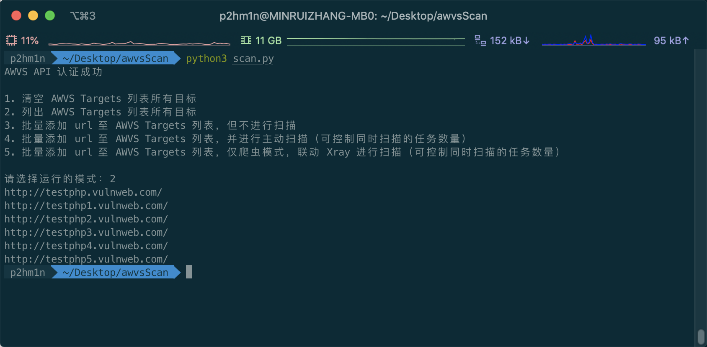

# awvsScan

awvsScan 是一款调用 AWVS 13.x API 的自动化工具

## 主要功能

主要实现以下功能

1. 清空 AWVS Targets 列表所有目标
2. 列出 AWVS Targets 列表所有目标
3. 批量添加 url 至 AWVS Targets 列表，但不进行扫描
4. 批量添加 url 至 AWVS Targets 列表，并进行主动扫描（可控制同时扫描的任务数量）
5. 批量添加 url 至 AWVS Targets 列表，仅爬虫模式，联动 Xray 进行扫描（可控制同时扫描的任务数量）


如果想自定义更多高级配置，可以选择第三个模式，导入目标后手动配置更多选项

## 配置信息

基础配置

```txt
# api 
api_key = ""

# 填写 AWVS 主页 URL
awvs_url = ""

# 填写 AWVS 登陆账户 email
awvs_email = ""
```

`scan_speed` 参考以下选项

| 参数       | 类型   | 说明                                        |
| :--------- | :----- | :------------------------------------------ |
| scan_speed | string | sequential <br>slow <br/>moderate <br/>fast |

`scan_id_type`参考以下选项

| 类型 | 值   |
| :----------------------------------- | :----------------------------------- |
| Full Scan                            | 11111111-1111-1111-1111-111111111111 |
| High Risk Vulnerabilities            | 11111111-1111-1111-1111-111111111112 |
| Cross-site Scripting Vulnerabilities | 11111111-1111-1111-1111-111111111116 |
| SQL Injection Vulnerabilities        | 11111111-1111-1111-1111-111111111113 |
| Weak Passwords                       | 11111111-1111-1111-1111-111111111115 |
| Crawl Only                           | 11111111-1111-1111-1111-111111111117 |
| Malware Scan                         | 11111111-1111-1111-1111-111111111120 |

`scan_number` 为同时扫描的任务数量（建议为3）


爬虫模式代理相关配置

```
# 使用代理的主机
proxy_address = "127.0.0.1"
# 使用代理的端口
proxy_port = 7777
```

## 使用方式

运行脚本可以选择运行的模式

- **列出 AWVS Targets 列表所有目标 （AWVS Targets 列表为空时）**


- **列出 AWVS Targets 列表所有目标 （AWVS Targets 列表不为空时）**




- **清空 AWVS Targets 列表所有目标**


- **批量添加 url 至 AWVS Targets 列表，但不进行扫描**


- **批量添加 url 至 AWVS Targets 列表，并进行主动扫描（可控制同时扫描的任务数量）**


- **批量添加 url 至 AWVS Targets 列表，仅爬虫模式，联动 Xray 进行扫描（可控制同时扫描的任务数量）**


效果同上


## 参考资料

[AWVS13.X API学习记录](https://www.sqlsec.com/2020/04/awvsapi.html#toc-heading-32)

[xray 安全评估工具文档](https://docs.xray.cool/)

